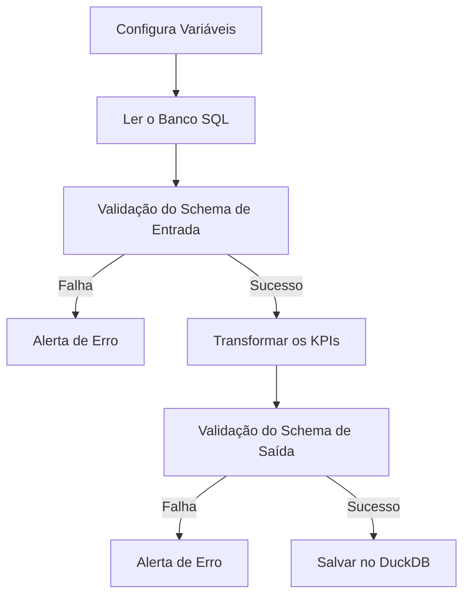

# Workshop 02 - Data Quality em Projetos de Dados

Bem-vindo à documentação do Workshop 02, focado na implementação de **data quality** em projetos de dados. 
## Objetivo
Desenvolver uma ETL com testes de qualidade de dados. Visa-se impedir que erros subam para as etapas finais do pipeline (o famoso "gold" no padrão medalhão).

## Fluxo do projeto
Abaixo, segue o fluxo de trabalho que iremos implementar.

## Contrato de dados

::: app.schema.ProdutoSchema